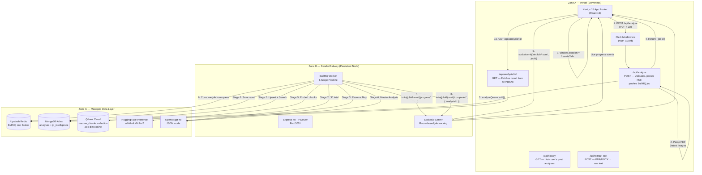

# AI Resume Analyzer — Re-Engineered Developer Reference

> **This is the single source of truth for every engineer who touches this codebase.**
> It documents real code, real schemas, real architectural decisions, and known failure modes — derived from a full audit of every file in the project. If the code changes, this document must change too.

---

## Table of Contents

1. [System Tenets & Architectural Philosophy](#1-system-tenets--architectural-philosophy)
2. [Monorepo Layout — Every File Explained](#2-monorepo-layout--every-file-explained)
3. [Dependency Map & Tech Stack](#3-dependency-map--tech-stack)
4. [Global Architecture Diagram](#4-global-architecture-diagram)
5. [The 6-Stage Deterministic Worker Pipeline](#5-the-6-stage-deterministic-worker-pipeline)
6. [LLM Prompt Engineering Reference](#6-llm-prompt-engineering-reference)
7. [All Data Schemas (TypeScript Ground Truth)](#7-all-data-schemas-typescript-ground-truth)
8. [MongoDB Collections Reference](#8-mongodb-collections-reference)
9. [Qdrant Vector DB Reference](#9-qdrant-vector-db-reference)
10. [Message Broker & WebSocket Synchronization Protocol](#10-message-broker--websocket-synchronization-protocol)
11. [API Routes Reference](#11-api-routes-reference)
12. [Frontend Component Architecture](#12-frontend-component-architecture)
13. [Authentication Layer — Clerk](#13-authentication-layer--clerk)
14. [Environment Variables — Full Reference](#14-environment-variables--full-reference)
15. [Local Development Setup](#15-local-development-setup)
16. [Deployment Topography (3-Zone Architecture)](#16-deployment-topography-3-zone-architecture)
17. [Known Bugs, Risks & Mitigations](#17-known-bugs-risks--mitigations)
18. [Roadmap to Phase 5 — Predictive Org Matching](#18-roadmap-to-phase-5--predictive-org-matching)

---

## 1. System Tenets & Architectural Philosophy

These are the non-negotiable engineering laws that every design decision in this project was made under. Violating them is a regression.

| # | Tenet | Why It Exists |
|---|-------|--------------|
| **T1** | **Never trust the LLM with raw extraction** | LLMs hallucinate structure. All text extraction, Unicode normalization, and section chunking happen *deterministically* in pure TypeScript before any LLM sees the data. |
| **T2** | **Defy serverless time limits** | The full pipeline takes 30–90 seconds. Vercel/Lambda time out at 10–15s. The compute is fully decoupled via BullMQ + Redis so the API route returns in milliseconds while the worker runs in persistent Node.js. |
| **T3** | **Transparent execution, never a dead spinner** | Real-time progress is streamed over bi-directional Socket.io WebSockets at every pipeline stage boundary. The user sees exactly what step is running and its percent completion. |
| **T4** | **Data gravity over prompt injection** | 384-dimensional embeddings + Qdrant cosine similarity scoring happen *before* the final LLM call. The LLM synthesizes pre-computed facts, not raw text — dramatically reducing hallucination and prompt cost. |
| **T5** | **JSON mode enforcement** | Every OpenAI call uses `response_format: { type: "json_object" }`. Schemas are enforced both by the system prompt and by post-parse validation in the worker. |
| **T6** | **Fail loud, fail fast** | If any pipeline stage fails, the worker throws immediately. The `worker.on('failed')` handler logs the error and the client is notified via Socket.io. No silent swallowing. |

---

## 2. Monorepo Layout — Every File Explained

```
resume-analyzer_upgraded/
│
├── app/                          # Next.js 15 App Router (runs on Vercel)
│   ├── api/
│   │   ├── analyze/
│   │   │   └── route.ts          # POST /api/analyze — Entry point. Parses PDF, queues BullMQ job, returns jobId.
│   │   ├── analysis/
│   │   │   └── [id]/route.ts     # GET /api/analysis/:id — Fetches a single analysis from MongoDB by ObjectId.
│   │   ├── extract-text/
│   │   │   └── route.ts          # POST /api/extract-text — Extracts raw text from PDF/DOCX for JD upload.
│   │   └── history/
│   │       └── route.ts          # GET /api/history — Returns all analyses for the authenticated Clerk user.
│   │
│   ├── components/
│   │   ├── Navbar.tsx            # Top nav with Clerk auth buttons and dark mode toggle.
│   │   ├── ResumeForm.tsx        # Main upload form. Manages Socket.io connection and progress display.
│   │   ├── Results.tsx           # Full analysis results renderer. Accepts AnalysisResult prop.
│   │   ├── ThemeProvider.tsx     # next-themes wrapper for dark/light mode.
│   │   └── ThemeToggle.tsx       # Sun/Moon icon toggle button.
│   │
│   ├── lib/
│   │   ├── mongodb.ts            # Singleton MongoClient connection. Lazy-initialized.
│   │   ├── openai-api.ts         # Wrapper around OpenAI SDK. Always uses gpt-4o + JSON mode.
│   │   ├── pdf-image-detector.ts # Uses pdfjs-dist to count embedded XObject images in PDF.
│   │   ├── pdf-parser.ts         # Wraps pdf-parse/lib/pdf-parse.js directly (avoids debug-mode ENOENT bug).
│   │   └── redis.ts              # ioredis connection + BullMQ Queue export (analyzeQueue).
│   │
│   ├── history/
│   │   └── page.tsx              # /history — Lists all past analyses for signed-in user.
│   ├── results/
│   │   └── page.tsx              # /results?id=:id — Fetches from DB and renders Results component.
│   ├── globals.css               # Tailwind base styles + custom CSS variables.
│   ├── layout.tsx                # Root layout. Wraps app in ClerkProvider + ThemeProvider + Navbar.
│   └── page.tsx                  # / — Renders ResumeForm.
│
├── backend/                      # Persistent Node.js server (runs on Render/Railway/EC2)
│   ├── index.ts                  # Express + Socket.io server. Exports `io`. Initializes Qdrant on boot.
│   ├── worker.ts                 # BullMQ Worker. Runs the 6-stage pipeline per job.
│   └── lib/
│       ├── embeddings.ts         # HuggingFace Inference API wrapper. Generates 384-dim vectors.
│       ├── qdrant.ts             # QdrantClient config. Collection creation and index initialization.
│       └── prompts.ts            # All LLM prompt templates. JD Intel, Resume Map, Master Analysis.
│
├── middleware.ts                 # Clerk auth middleware. Protects all routes except `/` and `/api/auth/signin`.
├── next.config.js                # serverExternalPackages: ['pdfjs-dist']. bodySizeLimit: 5mb.
├── tsconfig.json                 # Next.js TypeScript config. Excludes `backend/` directory.
├── tsconfig.server.json          # Separate TS config for backend. CommonJS + outDir: dist-server.
├── docker-compose.yml            # Local dev: spins up MongoDB + Qdrant containers.
├── render.yaml                   # Render.com deployment config for backend service.
├── package.json                  # Unified package.json. Scripts for dev, build, and concurrent start.
└── .env                          # Secrets (never committed). See Section 14.
```

---

## 3. Dependency Map & Tech Stack

### Production Dependencies

| Package | Version | Role |
|---------|---------|------|
| `next` | 15.4.8 | Frontend framework (App Router) |
| `react` / `react-dom` | 19.1.0 | UI library |
| `@clerk/nextjs` | ^6.28.1 | Authentication (frontend SSR) |
| `@clerk/express` | ^2.1.20 | Authentication (backend Express) |
| `openai` | ^5.11.0 | OpenAI SDK (gpt-4o, JSON mode) |
| `@huggingface/inference` | ^4.13.18 | HF API for `all-MiniLM-L6-v2` embeddings |
| `@qdrant/js-client-rest` | ^1.18.0 | Qdrant vector DB client |
| `bullmq` | ^5.77.0 | Redis-backed job queue |
| `ioredis` | ^5.10.1 | Redis client (required by BullMQ) |
| `mongodb` | ^7.2.0 | MongoDB client |
| `socket.io` | ^4.8.3 | WebSocket server (backend) |
| `socket.io-client` | ^4.8.3 | WebSocket client (frontend) |
| `express` | ^5.2.1 | HTTP server wrapper for Socket.io |
| `pdf-parse` | ^1.1.1 | PDF text extraction |
| `pdfjs-dist` | ^5.7.284 | PDF image detection (XObject counting) |
| `mammoth` | ^1.12.0 | DOCX → text extraction |
| `lucide-react` | ^0.536.0 | Icon library |
| `next-themes` | ^0.4.6 | Dark/light mode provider |
| `uuid` | ^14.0.0 | UUIDs for Qdrant point IDs |
| `dotenv` | ^17.4.2 | Env var loading in backend process |
| `cors` | ^2.8.6 | CORS headers on Express server |

### Dev Dependencies

| Package | Role |
|---------|------|
| `typescript` ^5.8.3 | Type checking |
| `ts-node` ^10.9.2 | Run backend TypeScript directly |
| `concurrently` ^9.2.1 | Run Next.js + backend server simultaneously |
| `tailwindcss` ^4 | CSS utility framework |
| `@tailwindcss/postcss` ^4 | PostCSS integration |
| `eslint` / `eslint-config-next` | Linting |

---

## 4. Global Architecture Diagram



---

## 5. The 6-Stage Deterministic Worker Pipeline

**File:** [`backend/worker.ts`](file:///c:/code/30day_challange/AI/resume-analyzer_upgraded/backend/worker.ts)

The worker is instantiated as a `BullMQ Worker` listening on the `analyze-resume` queue. Each job carries the `AnalyzeJobData` payload:

```typescript
interface AnalyzeJobData {
  resumeText: string;       // Raw text extracted server-side from PDF
  jobDescription: string;   // Raw JD text (pasted or extracted from file)
  clerkUserId: string;      // Clerk user ID for DB association
  resumeFilename: string;   // Original filename for display in history
  atsIssues: string[];      // Legacy pre-checks from the API route (image count, missing sections)
}
```

---

### Stage 1 — Text Normalization (0% → 10%)

**Socket emit:** `{ step: 'Stage 1/6: Cleaning document text...', percent: 10 }`

The `cleanText()` function applies a deterministic regex normalization pipeline:

```typescript
function cleanText(text: string): string {
  let cleaned = text;
  cleaned = cleaned.replace(/fi/g, 'fi').replace(/fl/g, 'fl').replace(/ff/g, 'ff'); // Unicode ligatures
  cleaned = cleaned.replace(/\u00AD/g, '');              // Strip soft hyphens
  cleaned = cleaned.replace(/[•▪◦–*]/g, '-');            // Normalize bullet styles
  cleaned = cleaned.replace(/\t/g, ' ');                  // Tabs to spaces
  cleaned = cleaned.replace(/\n{3,}/g, '\n\n');           // Collapse excess newlines
  return cleaned.trim();
}
```

**Why each transform exists:**
- **Ligatures:** The string `"financial"` (ligature) will never match `"financial"` in LLM tokenization or string search. This breaks keyword matching entirely.
- **Soft hyphens (`\u00AD`):** PDF renderers insert these invisibly for line-breaking. They corrupt words like `"data-base"` into `"data­base"`.
- **Bullet normalization:** JD prompts look for bullet-like structures. Unified `-` makes regex patterns predictable.
- **Newline collapse:** The LLM context is finite. 30 blank lines between sections is wasted tokens.

---

### Stage 2 — JD Intelligence Extraction with SHA-256 Cache (10% → 25%)

**Socket emit:** `{ step: 'Stage 2/6: Extracting Job Description intelligence...', percent: 25 }`

**Hash-based cache lookup:**
```typescript
const jdHash = crypto.createHash('sha256')
  .update(jobDescription.toLowerCase().trim())
  .digest('hex');

const cachedIntel = await db.collection('jd_intelligence').findOne({ jdHash });
if (cachedIntel) {
  jdIntel = cachedIntel.data;         // ← skips the 5-second OpenAI call
} else {
  const { response } = await callOpenAIApi(jdPrompt, { systemPrompt: JD_INTEL_SYSTEM_PROMPT });
  jdIntel = JSON.parse(response);
  await db.collection('jd_intelligence').insertOne({ jdHash, data: jdIntel, createdAt: new Date() });
}
```

**Output structure (`jdIntel`)** — see full schema in [Section 7](#7-all-data-schemas-typescript-ground-truth).

Key fields used downstream:
- `rubricWeights` → injected into Stage 6 master prompt as `{{W_SKILLS}}`, `{{W_YOE}}`, etc.
- `mustHaveSkills` / `niceToHaveSkills` → keyword matching in Stage 6
- `seniorityLevel` → seniority mismatch detection in Stage 6

---

### Stage 3 — Resume Section Mapping & Fact Extraction (25% → 40%)

**Socket emit:** `{ step: 'Stage 3/6: Mapping resume sections...', percent: 40 }`

The LLM is asked to identify section boundaries and extract structured facts. It returns `detectedHeaderRawText` for each section — the *exact* text as it appears in the resume (e.g., `"Work History"` instead of just `"experience"`).

This output (`resumeMap`) serves two purposes:
1. **Stage 4 uses `detectedHeaderRawText`** to find section boundaries and chunk text correctly.
2. **Stage 6 uses `extractedFacts`** to provide the LLM with pre-computed facts (YoE, skills list, seniority signal, quantified achievements).

The `atsWarnings` array is also generated here — these are stored alongside the final result in MongoDB.

---

### Stage 4 — Section-Aware Semantic Chunking (40% → 55%)

**Socket emit:** `{ step: 'Stage 4/6: Chunking text semantically...', percent: 55 }`

This is the most critical custom algorithm in the codebase. Standard chunkers (LangChain, etc.) split by character count, producing chunks that mix `experience` and `skills` tokens together, destroying semantic isolation.

**Algorithm:**

```
1. Build rawHeaders[] from Stage 3 output:
   rawHeaders = [{ key: 'experience', normalized: 'work history' }, ...]

2. Walk the resume line by line:
   for each line:
     normalize: lowercase, collapse spaces
     if line is short (<6 words) AND not a bullet AND matches a rawHeader:
       flush currentBlock → sections[]
       set currentSectionName = matchedHeader.key
     else:
       push line to currentBlock
   flush final block

3. For each section, split into sentence-level chunks:
   max chunk size = 800 chars (~150-200 tokens)
   min chunk size = 20 chars (discard noise)
```

**Why 800 chars?**
The `all-MiniLM-L6-v2` model has a 256 token limit. 800 chars ≈ 150-200 tokens — leaving headroom for the section prefix `[EXPERIENCE] `.

**Section prefix injection:**
```typescript
const prefix = `[${chunk.section.toUpperCase()}] `;
const embedding = await generateEmbedding(prefix + chunk.text);
```

This teaches the embedding model that the chunk came from the `EXPERIENCE` section, not `SKILLS`.

---

### Stage 5 — Semantic Vector Scoring (55% → 70%)

**Socket emit:** `{ step: 'Stage 5/6: Vector similarity scoring...', percent: 70 }`

**Full flow:**

```
1. Embed the full JD text (sliced to 8000 chars to stay under token limit)
2. For each chunk from Stage 4:
   - Generate 384-dim embedding
   - Upsert into Qdrant with payload: { jobId, clerkUserId, text, section }
3. Cosine similarity search in Qdrant:
   - Filter by jobId (so we only score THIS job's chunks)
   - Limit: top 20 results
4. Apply section weights to cosine scores:
   experience: ×2.0 | skills: ×1.8 | projects: ×1.5 | education: ×1.0 | summary: ×0.7
5. Compute weighted average → semanticScore (0-100)
6. Detect semantic gaps:
   if experience section avg < 65% OR skills section avg < 60%:
     push to semanticGaps[]
```

**The `semanticGaps` array** is injected into Stage 6's master prompt verbatim, allowing the LLM to produce actionable gap descriptions without doing its own vector math.

---

### Stage 6 — Master LLM Synthesis (70% → 95%)

**Socket emit:** `{ step: 'Stage 6/6: Generating master analysis...', percent: 85 }`

The master prompt is constructed by injecting all prior stage outputs:

```typescript
const masterPrompt = MASTER_ANALYSIS_USER_PROMPT
  .replace('{{CLEANED_RESUME_TEXT}}', cleanedResume)
  .replace('{{JD_TEXT}}', jobDescription)
  .replace('{{JD_INTEL_JSON}}', JSON.stringify(jdIntel))
  .replace('{{RESUME_FACTS_JSON}}', JSON.stringify(resumeMap))
  .replace('{{SEMANTIC_GAPS_JSON}}', JSON.stringify(semanticGaps))
  .replace('{{W_SKILLS}}', jdIntel.rubricWeights?.technicalSkills?.toString() || "35")
  .replace('{{W_YOE}}', jdIntel.rubricWeights?.yearsOfExperience?.toString() || "20")
  .replace('{{W_EDU}}', jdIntel.rubricWeights?.education?.toString() || "10")
  .replace('{{W_KEYWORDS}}', jdIntel.rubricWeights?.keywordCoverage?.toString() || "20")
  .replace('{{W_SOFT}}', jdIntel.rubricWeights?.softSkillsAndLeadership?.toString() || "15");
```

**The LLM is NOT doing any of the heavy lifting.** It is synthesizing. The hard work is already done.

After Stage 6, the result is merged and saved to MongoDB:

```typescript
const analysisResult = {
  ...finalAnalysis,           // LLM output
  semanticScore,              // Stage 5 output
  semanticGaps,               // Stage 5 output
  jdIntel,                    // Stage 2 output
  resumeFacts: resumeMap.extractedFacts,   // Stage 3 output
  atsWarnings: resumeMap.atsWarnings,      // Stage 3 output
};

// Saved to db.collection('analyses')
```

**Socket completion emit:**
```typescript
io.to(job.id!).emit('completed', { analysisId, analysisResult });
```

---

## 6. LLM Prompt Engineering Reference

**File:** [`backend/lib/prompts.ts`](file:///c:/code/30day_challange/AI/resume-analyzer_upgraded/backend/lib/prompts.ts)

### Prompt 1: `JD_INTEL_SYSTEM_PROMPT` + `JD_INTEL_USER_PROMPT`

- **Role:** Structured job description parser
- **Key constraint:** Only mark a skill as `mustHave` if it's *explicitly* required, not just preferred
- **Rubric weight rules** are hardcoded into the prompt by seniority tier:

| Level | technicalSkills | yearsOfExperience | education | keywordCoverage | softSkills |
|-------|:-:|:-:|:-:|:-:|:-:|
| intern/junior | 50 | 5 | 10 | 25 | 10 |
| mid | 40 | 20 | 10 | 20 | 10 |
| senior | 35 | 25 | 10 | 15 | 15 |
| lead | 30 | 20 | 5 | 15 | 30 |
| executive | 15 | 15 | 5 | 10 | 55 |

### Prompt 2: `RESUME_MAP_SYSTEM_PROMPT` + `RESUME_MAP_USER_PROMPT`

- **Role:** Resume section detector and fact extractor
- **Key constraint:** Do NOT infer or guess. Return `null` or `[]` for absent fields.
- Detects all common section name variants: `"Work History"`, `"Professional Experience"`, `"Career Summary"` all map to `experience`.
- Returns `atsWarnings[]` with severity (`critical` / `warning` / `info`)

### Prompt 3: `MASTER_ANALYSIS_SYSTEM_PROMPT` + `MASTER_ANALYSIS_USER_PROMPT`

- **Role:** Expert resume analyst synthesizing pre-computed pipeline outputs
- **Key constraints:**
  - Use `rubricWeights` EXACTLY as provided — do not hallucinate a different rubric
  - Score each rubric category independently, then compute weighted total
  - Do not penalize for YoE if `yoeExplicit` is false in JD intel
  - Detect seniority mismatch if `resumeFacts.senioritySignal !== jdIntel.seniorityLevel`
  - All bullet rewrites MUST start with an action verb and include a metric where possible

---

## 7. All Data Schemas (TypeScript Ground Truth)

### `AnalyzeJobData` — BullMQ Job Payload

```typescript
interface AnalyzeJobData {
  resumeText: string;
  jobDescription: string;
  clerkUserId: string;
  resumeFilename: string;
  atsIssues: string[];
}
```

### `JdIntelligence` — Output of Stage 2

```typescript
interface JdIntelligence {
  roleTitle: string;
  seniorityLevel: 'intern' | 'junior' | 'mid' | 'senior' | 'lead' | 'executive';
  seniorityConfidence: 'high' | 'medium' | 'low';
  senioritySignals: string[];
  yoeMin: number | null;
  yoeMax: number | null;
  yoeExplicit: boolean;
  mustHaveSkills: string[];
  niceToHaveSkills: string[];
  educationRequired: 'none' | 'any' | 'bachelors' | 'masters' | 'phd';
  educationFlexible: boolean;
  industryDomain: string;
  softSkillsRequired: string[];
  leadershipRequired: boolean;
  leadershipSignals: string[];
  remotePolicy: 'remote' | 'hybrid' | 'onsite' | 'unspecified';
  rubricWeights: {
    technicalSkills: number;    // All 5 fields must sum to 100
    yearsOfExperience: number;
    education: number;
    keywordCoverage: number;
    softSkillsAndLeadership: number;
  };
  rubricRationale: string;
}
```

### `ResumeMap` — Output of Stage 3

```typescript
interface ResumeMap {
  sections: {
    contactInfo:    SectionMeta & { hasEmail: boolean; hasPhone: boolean; hasLinkedIn: boolean; hasLocation: boolean };
    summary:        SectionMeta;
    experience:     SectionMeta;
    education:      SectionMeta;
    skills:         SectionMeta;
    projects:       SectionMeta;
    certifications: SectionMeta;
    achievements:   SectionMeta;
  };
  extractedFacts: {
    fullName: string | null;
    totalYoe: number | null;
    yoeCalculationNote: string | null;
    highestEducation: 'highschool' | 'bachelors' | 'masters' | 'phd' | 'unspecified';
    educationField: string | null;
    allSkillsMentioned: string[];
    programmingLanguages: string[];
    frameworks: string[];
    tools: string[];
    softSkillsMentioned: string[];
    companiesWorkedAt: string[];
    currentOrMostRecentTitle: string | null;
    senioritySignal: 'intern' | 'junior' | 'mid' | 'senior' | 'lead' | 'executive';
    hasQuantifiedAchievements: boolean;
    quantifiedAchievementCount: number;
    avgBulletLength: 'short' | 'medium' | 'long';
    usesFirstPerson: boolean;
    tenseConsistency: 'consistent' | 'mixed' | 'unknown';
  };
  atsWarnings: Array<{
    type: 'missingSectionRequired' | 'missingSectionRecommended' | 'formattingIssue' | 'contentIssue';
    message: string;
    severity: 'critical' | 'warning' | 'info';
  }>;
}

interface SectionMeta {
  present: boolean;
  detectedHeaderName: string | null;    // Canonical name (e.g. "experience")
  detectedHeaderRawText: string | null; // Exact text in doc (e.g. "Work History")
}
```

### `AnalysisResult` — Final Output & MongoDB Document

```typescript
export interface AnalysisResult {
  // LLM-generated fields (Stage 6)
  overallScore: number;                        // 0–100, weighted rubric total
  scoreInterpretation: 'strong' | 'moderate' | 'weak';
  rubricBreakdown: {
    technicalSkills:         { score: number; maxScore: number; rationale: string };
    yearsOfExperience:       { score: number; maxScore: number; rationale: string };
    education:               { score: number; maxScore: number; rationale: string };
    keywordCoverage:         { score: number; maxScore: number; rationale: string };
    softSkillsAndLeadership: { score: number; maxScore: number; rationale: string };
  };
  seniorityMismatch: {
    detected: boolean;
    resumeLevel: string;
    jdLevel: string;
    message: string | null;
  };
  keywordAnalysis: {
    matchedMustHave: string[];
    missingMustHave: string[];
    matchedNiceToHave: string[];
    missingNiceToHave: string[];
    unexpectedStrengths: string[];             // Strong resume skills not mentioned in JD
  };
  atsAnalysis: {
    overallAtsScore: number;                   // 0–100
    sectionFlags: Array<{
      section: string;
      status: 'present' | 'missing' | 'weak';
      severity: 'critical' | 'warning' | 'info';
      advice: string;
    }>;
    formattingFlags: string[];
  };
  bulletFeedback: Array<{
    original: string;
    issue: string;
    rewritten: string;
    improvementType: 'actionVerb' | 'addMetric' | 'clarity' | 'relevance';
  }>;
  grammarAndStyle: {
    issues: Array<{ text: string; issue: string; suggestion: string }>;
    toneAssessment: string;
    readabilityGrade: number;
    usesFirstPerson: boolean;
    tenseConsistency: string;
  };
  semanticInsights: {
    strongestSections: string[];
    weakestSections: string[];
    meaningGaps: Array<{ area: string; gap: string; suggestion: string }>;
  };
  topPriorityActions: Array<{
    priority: number;
    action: string;
    impact: 'high' | 'medium' | 'low';
    effort: 'high' | 'medium' | 'low';
  }>;
  summaryVerdict: string;

  // Pipeline-computed fields (merged in worker)
  semanticScore: number;
  semanticGaps: Array<{ section: string; score: number }>;
  jdIntel: JdIntelligence;
  resumeFacts: ResumeMap['extractedFacts'];
  atsWarnings: ResumeMap['atsWarnings'];

  // MongoDB document fields
  clerkUserId: string;
  resumeFilename: string;
  resumeText: string;
  jobDescription: string;
  createdAt: Date;
}
```

---

## 8. MongoDB Collections Reference

**Connection:** [`app/lib/mongodb.ts`](file:///c:/code/30day_challange/AI/resume-analyzer_upgraded/app/lib/mongodb.ts)
**Database name:** `resume-analyzer`

### Collection: `analyses`

Stores the complete merged `AnalysisResult` document per job. Written by the worker at the end of Stage 6.

| Field | Type | Notes |
|-------|------|-------|
| `_id` | `ObjectId` | MongoDB auto-ID. Stringified and returned as `analysisId`. |
| `clerkUserId` | `string` | Used to filter user's own history in `/api/history`. |
| `resumeFilename` | `string` | Display name in history list. |
| `resumeText` | `string` | Cleaned resume text (Stage 1 output). |
| `jobDescription` | `string` | Raw JD text. |
| `overallScore` | `number` | 0–100 weighted score. |
| `semanticScore` | `number` | 0–100 vector similarity score. |
| All `AnalysisResult` fields | — | Full analysis merged and saved. |
| `createdAt` | `Date` | Job completion timestamp. |

**History API query:**
```typescript
db.collection('analyses')
  .find({ clerkUserId })
  .sort({ createdAt: -1 })
  .limit(50)
```

### Collection: `jd_intelligence`

SHA-256 content-addressable cache for JD parsing results.

| Field | Type | Notes |
|-------|------|-------|
| `jdHash` | `string` | SHA-256 of `jobDescription.toLowerCase().trim()`. |
| `data` | `JdIntelligence` | Cached LLM output. |
| `createdAt` | `Date` | Cache entry creation time. |

> **Cache hit rate:** Extremely high in practice, since companies reuse the same JD across multiple job postings. Each cache hit saves ~5 seconds and ~$0.02 in API costs.

---

## 9. Qdrant Vector DB Reference

**Files:** [`backend/lib/qdrant.ts`](file:///c:/code/30day_challange/AI/resume-analyzer_upgraded/backend/lib/qdrant.ts), [`backend/lib/embeddings.ts`](file:///c:/code/30day_challange/AI/resume-analyzer_upgraded/backend/lib/embeddings.ts)

### Collection: `resume_chunks`

| Property | Value |
|----------|-------|
| Vector dimensions | 384 |
| Distance metric | Cosine |
| Model | `sentence-transformers/all-MiniLM-L6-v2` |
| Payload index | `jobId` (keyword, for per-job filtering) |

### Point Payload Schema

```typescript
{
  jobId: string;       // BullMQ job ID (used as filter key)
  clerkUserId: string;
  text: string;        // The raw chunk text (without the [SECTION] prefix)
  section: string;     // 'experience' | 'skills' | 'education' | 'projects' | 'summary'
}
```

### Section Weights (Stage 5)

```typescript
const sectionWeights: Record<string, number> = {
  experience: 2.0,
  skills:     1.8,
  projects:   1.5,
  education:  1.0,
  summary:    0.7,
};
```

### Initialization

`initializeQdrant()` is called on server boot in `backend/index.ts`. It:
1. Checks if `resume_chunks` collection exists; creates it if not.
2. Creates a payload index on `jobId` (idempotent — ignores "already exists" error).

> **Warning:** Qdrant points are never deleted after analysis. This collection grows unboundedly. A TTL cleanup job or a post-analysis delete call should be added in production.

---

## 10. Message Broker & WebSocket Synchronization Protocol

### BullMQ Queue

**Queue name:** `analyze-resume`
**Connection:** `ioredis` → Upstash Redis (requires TLS `rediss://` URL)

```typescript
// app/lib/redis.ts
export const redisConnection = new Redis(REDIS_URL, {
  maxRetriesPerRequest: null,  // REQUIRED by BullMQ
});

export const analyzeQueue = new Queue('analyze-resume', {
  connection: redisConnection,
});
```

### The Full Handshake Protocol

```
1. Client uploads PDF → POST /api/analyze
2. API route parses PDF, pushes job to BullMQ:
      const job = await analyzeQueue.add('analyze', { ... });
      return { jobId: job.id };
3. Client receives jobId, opens Socket.io connection to ws://SOCKET_SERVER_URL:
      const socket = io('http://localhost:3001');
4. Client emits join:
      socket.on('connect', () => socket.emit('joinJobRoom', jobId));
5. Server joins socket to room:
      socket.on('joinJobRoom', (jobId) => socket.join(jobId));
6. Worker picks up job, executes pipeline, emitting per stage:
      io.to(job.id!).emit('progress', { step: '...', percent: N });
7. Worker completes, emits:
      io.to(job.id!).emit('completed', { analysisId, analysisResult });
8. Client receives 'completed':
      socket.disconnect();
      window.location.href = `/results?id=${analysisId}`;
```

### Socket.io Events Reference

| Event | Direction | Payload | Description |
|-------|-----------|---------|-------------|
| `joinJobRoom` | Client → Server | `jobId: string` | Client subscribes to a job's room |
| `progress` | Server → Client | `{ step: string, percent: number }` | Pipeline stage update |
| `completed` | Server → Client | `{ analysisId: string, analysisResult: object }` | Pipeline finished |
| `error` | Server → Client | `{ message: string }` | Worker job failed |

### Orphaned Socket Behavior

If the user closes the browser tab mid-analysis:
- The BullMQ worker **continues running** — it has no dependency on the socket connection.
- The result is saved to MongoDB as normal.
- The user can retrieve their result from the `/history` page.

---

## 11. API Routes Reference

### `POST /api/analyze`

**File:** [`app/api/analyze/route.ts`](file:///c:/code/30day_challange/AI/resume-analyzer_upgraded/app/api/analyze/route.ts)
**Auth:** Required (Clerk)

**Request:** `multipart/form-data`
- `resume`: PDF file (max 5MB, enforced by `next.config.js`)
- `jobDescription`: string

**Server-side processing (synchronous, before queue):**
1. Authenticates Clerk user → gets `clerkUserId`
2. Validates file type (must be `application/pdf`)
3. Reads file buffer once (`Buffer.from(await resumeFile.arrayBuffer())`)
4. Runs `countImagesInPDF(buffer)` → appends image warning to `atsIssues` if > 0
5. Runs `parsePdf(buffer)` → extracts `resumeText`
6. Validates `resumeText` is non-empty (rejects image-based/scanned PDFs)
7. Runs basic ATS checks (looks for `Work Experience`, `Education`, `@` email)
8. Pushes job to `analyzeQueue.add('analyze', { ... })`

**Response:**
```json
{ "jobId": "string", "message": "Analysis job queued successfully" }
```

---

### `GET /api/analysis/:id`

**File:** [`app/api/analysis/[id]/route.ts`](file:///c:/code/30day_challange/AI/resume-analyzer_upgraded/app/api/analysis)
**Auth:** Required (Clerk)

Fetches a single `AnalysisResult` document from MongoDB by `ObjectId`. Returns 404 if not found.

---

### `GET /api/history`

**File:** [`app/api/history/route.ts`](file:///c:/code/30day_challange/AI/resume-analyzer_upgraded/app/api/history)
**Auth:** Required (Clerk)

Returns the last 50 analyses for the authenticated user, sorted by `createdAt` descending.

**Response:** `{ analyses: AnalysisSummary[] }`

```typescript
interface AnalysisSummary {
  id: string;
  resumeFilename: string;
  matchScore: number;           // Maps to overallScore
  atsIssueCount: number;
  matchingKeywordCount: number;
  missingKeywordCount: number;
  createdAt: string;
}
```

---

### `POST /api/extract-text`

**File:** [`app/api/extract-text/route.ts`](file:///c:/code/30day_challange/AI/resume-analyzer_upgraded/app/api/extract-text)
**Auth:** Not required (public)

Accepts a PDF or DOCX file, extracts raw text, and returns it. Used by `ResumeForm.tsx` to allow JD upload via file instead of paste.

- PDF files: processed via `pdf-parse`
- DOCX files: processed via `mammoth`

**Response:** `{ text: string }`

---

## 12. Frontend Component Architecture

### `ResumeForm.tsx`

**File:** [`app/components/ResumeForm.tsx`](file:///c:/code/30day_challange/AI/resume-analyzer_upgraded/app/components/ResumeForm.tsx)

The main page component. Manages all form state and the Socket.io lifecycle.

**Key state:**
- `resumeFile` — the selected PDF
- `jobDescription` — textarea content
- `jdFile` — the uploaded JD file (after extraction, text goes to `jobDescription`)
- `isLoading` / `progress` — controls the progress bar UI
- `extractingJD` — spinner state during `/api/extract-text` call

**Socket.io lifecycle (inside `handleSubmit`):**
```
POST /api/analyze → receive jobId
→ io('http://localhost:3001')
→ on('connect'): emit('joinJobRoom', jobId)
→ on('progress'): update progress bar
→ on('completed'): redirect to /results?id=...
→ on('error'): display error, stop loading
```

> **Critical note:** The socket URL is hardcoded to `http://localhost:3001` in development. In production, this must be `NEXT_PUBLIC_SOCKET_URL`. This is a **known tech debt item** — see [Section 17](#17-known-bugs-risks--mitigations).

---

### `Results.tsx`

**File:** [`app/components/Results.tsx`](file:///c:/code/30day_challange/AI/resume-analyzer_upgraded/app/components/Results.tsx)

Pure presentation component. Accepts a single `analysis: AnalysisResult` prop. No state, no side effects.

**Renders:**
1. Summary verdict + seniority mismatch alert
2. Top priority actions grid (max 5, color-coded by impact)
3. Overall score card + dynamic rubric breakdown with progress bars
4. Semantic meaning gaps + ATS section analysis (side-by-side)
5. Keyword coverage (matched/missing must-haves, nice-to-haves, unexpected strengths)
6. Experience bullet rewrites (original vs. rewritten, side-by-side)

**Score color thresholds:**
- `≥ 80%` → Green
- `60–79%` → Yellow
- `< 60%` → Red

---

### `Navbar.tsx`

**File:** [`app/components/Navbar.tsx`](file:///c:/code/30day_challange/AI/resume-analyzer_upgraded/app/components/Navbar.tsx)

Displays app name, navigation links (Home, History), Clerk `UserButton`, and `ThemeToggle`.

---

### `/results/page.tsx`

**File:** [`app/results/page.tsx`](file:///c:/code/30day_challange/AI/resume-analyzer_upgraded/app/results/page.tsx)

Reads `?id=` from URL. Fetches from `/api/analysis/:id`. Falls back to `?data=` (legacy: base64 JSON in URL — deprecated path). Renders `<Results />` component.

---

### `/history/page.tsx`

**File:** [`app/history/page.tsx`](file:///c:/code/30day_challange/AI/resume-analyzer_upgraded/app/history/page.tsx)

Fetches from `/api/history`. Renders a list of analysis summary cards. Each card links to `/results?id=...`. Requires Clerk sign-in — shows sign-in prompt if unauthenticated.

---

## 13. Authentication Layer — Clerk

**Middleware:** [`middleware.ts`](file:///c:/code/30day_challange/AI/resume-analyzer_upgraded/middleware.ts)

```typescript
const isPublicRoute = createRouteMatcher(['/', '/api/auth/signin']);

export default clerkMiddleware(async (auth, req) => {
  if (isPublicRoute(req)) return;  // No auth check for landing page
  await auth.protect();            // Redirect to Clerk sign-in for all other routes
});
```

**Matcher:** Runs on all paths except `_next/static`, `_next/image`, `favicon.ico`, and static file extensions.

**Backend auth:** API routes use `auth()` from `@clerk/nextjs/server` to get `clerkUserId`. The backend Express server uses `@clerk/express` but currently does not verify tokens on WebSocket connections — this is a known gap.

---

## 14. Environment Variables — Full Reference

> Store these in `.env` (root) for local dev, and in platform secrets for production.

| Variable | Required | Used In | Description |
|----------|----------|---------|-------------|
| `OPENAI_API_KEY` | ✅ | `app/lib/openai-api.ts`, backend worker | OpenAI API key |
| `HUGGINGFACE_API_KEY` | ✅ | `backend/lib/embeddings.ts` | HuggingFace Inference API key |
| `QDRANT_URL` | ✅ | `backend/lib/qdrant.ts` | Qdrant instance URL (e.g. `https://xyz.qdrant.io`) |
| `QDRANT_API_KEY` | ✅ | `backend/lib/qdrant.ts` | Qdrant API key |
| `DATABASE_URL` | ✅ | `app/lib/mongodb.ts` | MongoDB connection string (Atlas URI) |
| `REDIS_URL` | ✅ | `app/lib/redis.ts` | Redis connection string (**must use `rediss://` for Upstash TLS**) |
| `NEXT_PUBLIC_CLERK_PUBLISHABLE_KEY` | ✅ | Clerk SDK | Clerk publishable key |
| `CLERK_SECRET_KEY` | ✅ | Clerk SDK | Clerk secret key |
| `NEXT_PUBLIC_SOCKET_URL` | ⚠️ | `ResumeForm.tsx` (not yet used) | WebSocket server URL for production |
| `PORT` | Optional | `backend/index.ts` | Backend server port (defaults to `3001`) |
| `FRONTEND_URL` | ⚠️ Prod | `backend/index.ts` CORS | Vercel deployment URL for CORS allow-list |

> **Critical:** `REDIS_URL` must start with `rediss://` (TLS), not `redis://`. The `ioredis` client will connect silently but fail on the first queue operation, causing the Vercel API route to hang and timeout after 10s. This is the most common production failure mode.

---

## 15. Local Development Setup

### Prerequisites

- Node.js 20+
- Docker Desktop (for local MongoDB + Qdrant)
- Valid API keys for OpenAI, HuggingFace, and Clerk

### Step 1 — Start Infrastructure

```bash
docker-compose up -d
# Starts MongoDB on :27017 and Qdrant on :6333
```

### Step 2 — Configure Environment

Copy `.env` and fill in all required keys. For local dev, use:
```env
REDIS_URL=redis://localhost:6379
DATABASE_URL=mongodb://localhost:27017/resume-analyzer
QDRANT_URL=http://localhost:6333
QDRANT_API_KEY=         # Leave empty for local Qdrant
```

For Redis locally, you can use a local Redis instance OR an Upstash Redis instance (use `rediss://` URL).

### Step 3 — Install Dependencies

```bash
npm install
```

### Step 4 — Run Both Processes

```bash
npm run dev:all
# Equivalent to: concurrently "next dev" "ts-node --project tsconfig.server.json backend/index.ts"
```

- **Next.js** → `http://localhost:3000`
- **Backend (Socket.io + Worker)** → `http://localhost:3001`

### NPM Scripts Quick Reference

| Script | Command | Purpose |
|--------|---------|---------|
| `dev` | `next dev` | Next.js dev server only |
| `dev:server` | `ts-node backend/index.ts` | Backend server only |
| `dev:all` | `concurrently ...` | Both simultaneously |
| `build:next` | `next build` | Build Next.js for production |
| `build:server` | `tsc --project tsconfig.server.json` | Compile backend to `dist-server/` |
| `build` | `build:next && build:server` | Full production build |
| `start:next` | `next start` | Serve production Next.js build |
| `start:server` | `node dist-server/backend/index.js` | Run compiled backend |
| `start` | `concurrently ...` | Both simultaneously (production) |

---

## 16. Deployment Topography (3-Zone Architecture)

The application **cannot** be deployed as a monolith. The BullMQ worker requires a persistent process.

### Zone A — Vercel (Serverless Edge)

Deploys the Next.js App Router automatically from the repository root.

**Configure:**
- Build command: `npm run build:next`
- Output directory: `.next`
- Set all env vars in Vercel project settings

**What runs here:**
- Next.js 15 App Router
- All `/api/*` routes (serverless functions)
- Clerk authentication middleware

---

### Zone B — Render.com (Persistent Compute)

**Config file:** [`render.yaml`](file:///c:/code/30day_challange/AI/resume-analyzer_upgraded/render.yaml)

```yaml
services:
  - type: web
    name: resume-analyzer-backend
    env: node
    plan: free
    buildCommand: npm install && npm run build:server
    startCommand: npm run start:server
    envVars:
      - key: REDIS_URL
      - key: MONGODB_URI
      - key: OPENAI_API_KEY
      - key: QDRANT_URL
      - key: QDRANT_API_KEY
      - key: FRONTEND_URL
        value: https://resume-analyser-upgraded.vercel.app
      - key: PORT
        value: 10000
```

**What runs here:**
- Express HTTP server (serves Socket.io handshakes)
- Socket.io WebSocket server (room-based job tracking)
- BullMQ Worker (executes the 6-stage pipeline)

> **Note:** Render free tier spins down after 15 minutes of inactivity. The first request after a cold start will timeout. Upgrade to a paid Render plan for production reliability.

---

### Zone C — Managed Data Layer

| Service | Used For | Notes |
|---------|----------|-------|
| **Upstash Redis** | BullMQ job broker | Must use `rediss://` TLS URL |
| **MongoDB Atlas** | Long-term storage (`analyses`, `jd_intelligence`) | M0 free tier sufficient for dev |
| **Qdrant Cloud** | Vector similarity search | Free tier: 1GB storage, 1M vectors |
| **HuggingFace** | `all-MiniLM-L6-v2` embeddings | Free tier (rate-limited) |
| **OpenAI** | `gpt-4o` analysis (Stages 2, 3, 6) | Pay-per-token; ~$0.05–0.15 per analysis |
| **Clerk** | Authentication + user management | Free up to 10,000 MAU |

---

## 17. Known Bugs, Risks & Mitigations

| # | Severity | Issue | Root Cause | Mitigation |
|---|----------|-------|-----------|------------|
| **B1** | 🔴 Critical | `REDIS_URL` uses `redis://` instead of `rediss://` | `ioredis` connects but TLS handshake fails silently | Validate env var prefix on startup; throw if not `rediss://` |
| **B2** | 🔴 Critical | Socket URL hardcoded to `localhost:3001` in `ResumeForm.tsx` | `const socket = io('http://localhost:3001')` — no env var lookup | Replace with `process.env.NEXT_PUBLIC_SOCKET_URL` |
| **B3** | 🟠 High | Qdrant points never cleaned up post-analysis | No TTL or delete call after Stage 5 search | Add `qdrantClient.delete(COLLECTION_NAME, { filter: { must: [{ key: 'jobId', match: { value: job.id } }] } })` after Stage 6 |
| **B4** | 🟠 High | MongoDB client not singleton in serverless context | New `MongoClient` created per cold start | Add connection pooling guard; reuse across invocations (already partially done via module-level `let client`) |
| **B5** | 🟡 Medium | `AnalysisResult` interface duplicated in 3 files | Defined in `Results.tsx`, `route.ts` (legacy), and `history/page.tsx` uses its own `AnalysisSummary` | Extract to `app/types/analysis.ts` and import everywhere |
| **B6** | 🟡 Medium | Legacy `?data=` URL path in `/results/page.tsx` | Entire analysis result serialized to URL query param | Remove legacy path; always use MongoDB `?id=` path |
| **B7** | 🟡 Medium | Render free tier cold starts | Process sleeps after 15 min inactivity | Upgrade to Render Starter plan ($7/mo) or add a keep-alive ping |
| **B8** | 🟢 Low | `max_tokens: 2500` may truncate master analysis | `gpt-4o` JSON output can be large for resumes with many bullets | Increase to `4096` or stream the response |
| **B9** | 🟢 Low | No retry logic on HuggingFace embedding calls | Rate limits return 429 silently; Stage 5 fails | Wrap `generateEmbedding()` in exponential backoff |
| **B10** | 🟢 Low | `pdf-parse` is imported from internal path | `import pdfParse from 'pdf-parse/lib/pdf-parse.js'` bypasses the package index to avoid ENOENT debug mode bug | Document this as intentional; add comment to deter "fixing" it |

---

## 18. Roadmap to Phase 5 — Predictive Org Matching

The architecture was intentionally designed to extend to organizational-scale team matching.

**Foundation already in place:**
- Every analysis stores `resumeFacts` (skills, YoE, seniority) in MongoDB
- Every analysis stores 384-dim embeddings in Qdrant (keyed by `clerkUserId`)
- The `rubricWeights` system is role-configurable

**Phase 5 Implementation Steps:**

### Step 1 — Organizational Index
Create a new Qdrant collection `org_team_profiles`. For each internal team, embed a "team description" document and store it with payload `{ orgId, teamName, departmentName }`.

### Step 2 — Candidate Routing API
Create a new endpoint `POST /api/org/match`. It:
1. Loads the candidate's `experience` chunk embeddings from Qdrant (by `clerkUserId`)
2. Runs a batch cosine search against `org_team_profiles`
3. Returns top-N team matches with similarity scores

### Step 3 — Predictive Dashboard
Frontend: new `/org/:orgId/dashboard` page showing:
- Candidate intake pipeline
- Team match heatmap
- Seniority distribution overlay

**Projected Output:**
```
"Candidate belongs in Frontend Platform Team with 92% similarity.
 Secondary match: Design Systems Team at 84%.
 Recommend bypassing general HR screening."
```

---

*Document version: 2.0 — Re-engineered May 2026*
*Derived from full source code audit. Update this file whenever worker.ts, prompts.ts, or any schema changes.*
